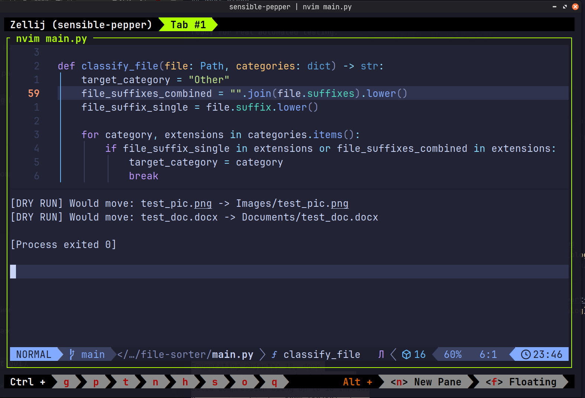

# File Sorter (Part 2): Functions, Dry-Run, and Safe Duplicates

In my [previous post](file-sorter.md), I built a basic Python script to
clean up a cluttered Downloads folder. It did the job, but it was just a
procedural script with clear risks: it could overwrite files with
duplicate names, and running it meant making changes directly to the
filesystem without a preview.

As someone training to become a QA engineer, I realized this was not
reliable enough. Before writing automated tests, code must be modular
and predictable.

Here is how I upgraded the script to make it safer and test-ready.

---

## What Changed?

### 1. Modular Functions (Preparing for Pytest)

In the first version, everything ran in a single loop. To test logic
effectively, inputs and outputs need to be isolated. I split the logic
into dedicated functions:

* `classify_file()`: pure logic that only determines the category.
* `get_unique_path()`: handles file naming collisions.
* `move_file()`: handles the actual filesystem operation.
* `sort_directory()`: coordinates the entire workflow.

### 2. Collision Handling: No Overwrites

If you download `report.pdf` multiple times, standard move operations
might overwrite older files. I added `get_unique_path()` to append an
incrementing index if a file already exists in the target folder:

```python
def get_unique_path(destination: Path) -> Path:
    if not destination.exists():
        return destination
    counter = 1
    while True:
        new_filename = (
            f"{destination.stem}_{counter}{destination.suffix}"
        )
        new_destination = destination.parent / new_filename
        if not new_destination.exists():
            return new_destination
        counter += 1
```

Now, `report.pdf` safely becomes `report_1.pdf`, protecting user data.

<!-- more -->

### 3. Dry-Run Mode

Testing file operations on real directories can be risky. Adding a
`dry_run=True` flag allows previewing exactly what the script will do
without touching a single file:


*Demonstration of the script running in dry-run mode to preview safe
file organization and duplicate resolution.*

---

## Full Updated Script

Here is the refactored `main.py`:

```python
import shutil
from pathlib import Path

CATEGORIES = {
    "Images": [
        ".jpg",
        ".jpeg",
        ".png",
        ".gif",
    ],
    "Documents": [
        ".pdf",
        ".docx",
        ".txt",
        ".xlsx",
        ".csv",
        ".json",
        ".log",
    ],
    "Installers": [
        ".deb",
        ".apk",
        ".exe",
        ".iso",
    ],
    "Torrents": [
        ".torrent",
    ],
    "Video": [
        ".mp4",
        ".m4v",
        ".avi",
        ".mov",
        ".mpeg",
        ".ts",
        ".mpg",
        ".vob",
        ".webm",
        ".mkv",
    ],
    "Scripts": [
        ".py",
        ".sh",
    ],
    "Archives": [
        ".zip",
        ".rar",
        ".tar.gz",
        ".7z",
        ".gz",
        ".tar",
        ".tar.zst",
    ],
}


def classify_file(file: Path, categories: dict) -> str:
    target_category = "Other"
    file_suffixes_combined = "".join(file.suffixes).lower()
    file_suffix_single = file.suffix.lower()

    for category, extensions in categories.items():
        if (
            file_suffix_single in extensions
            or file_suffixes_combined in extensions
        ):
            target_category = category
            break
    return target_category


def get_unique_path(destination: Path) -> Path:
    if not destination.exists():
        return destination
    counter = 1
    while True:
        new_filename = (
            f"{destination.stem}_{counter}{destination.suffix}"
        )
        new_destination = destination.parent / new_filename
        if not new_destination.exists():
            return new_destination
        counter += 1


def move_file(
    file: Path, target_folder: Path, dry_run: bool = False
) -> None:
    destination = target_folder / file.name
    destination = get_unique_path(destination)
    if dry_run:
        print(
            f"[DRY RUN] Would move: {file.name} -> "
            f"{target_folder.name}/{destination.name}"
        )
        return
    target_folder.mkdir(exist_ok=True, parents=True)
    try:
        shutil.move(str(file), str(destination))
        print(f"File: {file.name} | Category: {target_folder.name}")
    except (OSError, shutil.Error) as e:
        print(f"Error moving {file.name} {e}")


def sort_directory(
    directory_path: Path, categories: dict, dry_run: bool = False
) -> None:
    for file in directory_path.iterdir():
        if not file.is_file():
            continue
        target_category = classify_file(file, categories)
        target_folder = directory_path / target_category
        move_file(file, target_folder, dry_run=dry_run)


if __name__ == "__main__":
    downloads_dir = Path.home() / "Downloads"
    sort_directory(downloads_dir, CATEGORIES, dry_run=True)
```

---

## Next Steps

Now that the code is divided into small, independent functions, it is
ready for real automated testing.

In the upcoming part, I will focus on:

* Writing unit tests with **Pytest** using fixtures and temporary
  directories (`tmp_path`).
* Setting up a **CI pipeline** with GitHub Actions to run tests
  automatically on push.
